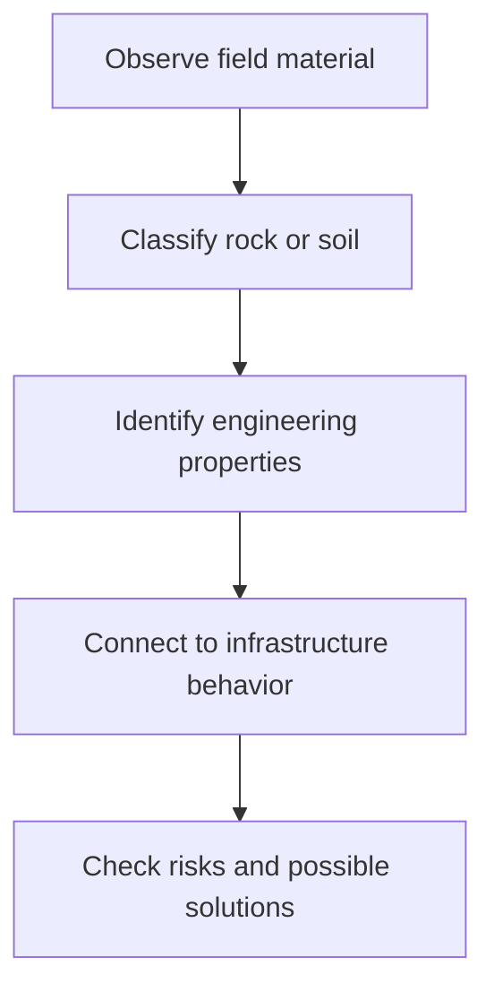

# GEO-31 Engineering Geology Learning Workspace

This project is a personal learning workspace for **GEO-31 Engineering Geology** from Instituto Tecnologico de Aeronautica.

The goal is to use teacher materials, such as PDFs, slides, documents, maps, lab files, images, articles, and exercises, to learn the course topics and create useful review materials.

Main course source:

- `materials/GEO-31_2026_plano_de_disciplina.pdf`

## Course Focus

GEO-31 studies the basic geological concepts needed in Civil Engineering.

The main goal is to understand rocks and soils in the field, evaluate their possible use, and predict their behavior in infrastructure works such as:

- buildings
- roads and runways
- slope stabilization
- dams
- foundations
- tunnels

## Main Topics

- Introduction to Engineering Geology and the Earth.
- Rock cycle.
- Minerals: types and properties.
- Igneous, sedimentary, and metamorphic rocks.
- Weathering.
- Brazilian geology examples.
- Rock masses, structures, and fractures.
- Soil formation, grain size, genesis classification, and occurrence in relief.
- Laterization, collapsible soils, expansive soils, and colluvium.
- SPT sounding, rotary drilling, parameters, and stratigraphic profiles.
- Geotechnical cartography and pedological maps.
- Other site investigation methods.
- Slope stability.
- Dams.
- Foundations.
- Roads.
- Tunnels.

## How To Use This Project

- Add source materials from classes, laboratories, and group work.
- Create notes from those materials.
- Use Markdown (`.md`) for notes and summaries.
- Keep notes organized by class, topic, source, laboratory, or project.
- Add diagrams when a process, classification, or infrastructure behavior has many steps.
- Add examples after theory.
- Connect each geology topic to Civil Engineering use.
- Create review summaries and questions for later study.

## Suggested Structure

```text
.
+-- README.md
+-- AGENTS.md
+-- materials/
|   +-- GEO-31_2026_plano_de_disciplina.pdf
|   +-- class-material.pdf
+-- notes/
|   +-- topic-name.md
+-- diagrams/
|   +-- topic-flow.md
+-- exercises/
|   +-- topic-exercises.md
+-- reviews/
    +-- topic-review.md
```

The folders above are suggestions. They can be created when needed.

## Note Template

```markdown
# Topic Name

## Source
- File:
- Class:
- Teacher:
- Date:

## Goal
What I want to understand.

## Key Ideas
- Important idea 1
- Important idea 2

## Definitions
- **Term:** simple explanation.

## Visual Idea
Describe the figure, map, profile, photo, or field situation.

## Engineering Meaning
Why this matters for buildings, roads, slopes, dams, foundations, or tunnels.

## Formula
`formula here`

Where:
- `symbol`: meaning and unit

## Example
Step-by-step example.

## Common Mistakes
- Mistake 1
- Mistake 2

## Summary
Short review of the topic.

## Questions To Review
- Question 1
- Question 2
```

## Diagram Example

Mermaid diagrams can be used for flows:



## Review Materials

Review files should be short and useful before tests, laboratories, exercises, and group presentations.

They can include:

- key definitions
- classifications
- field indicators
- important diagrams
- common mistakes
- solved examples
- questions to practice
- links to source files
