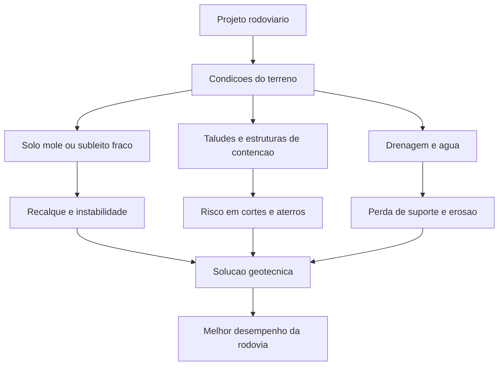

# Guia De Estudos De Caso Para Geotecnia De Rodovias

Este guia resume casos reais relacionados a rodovias encontrados nos documentos internos da pasta `estudo_de_casos`. Ele serve para ajudar na escolha de exemplos para um trabalho sobre rodovias no contexto geotecnico.

## O Que Sao Estes Documentos?

A pasta `estudo_de_casos` contem volumes em PDF do **HUESKER Report - Casos de Obras**. Esses documentos sao relatorios tecnicos de estudos de caso sobre obras reais de engenharia civil em que foram usados geossinteticos.

Eles sao uteis para um trabalho de geotecnia de rodovias porque muitos casos descrevem problemas reais em rodovias, vias urbanas, acessos, pavimentos, aterros, muros de contencao, solos moles, drenagem e construcao sobre terrenos fracos.

Quando a tabela indica **pagina do relatorio**, isso significa a pagina mostrada no indice do documento ou na propria pagina do relatorio, nao necessariamente a pagina exibida pelo visualizador de PDF.

## Ideia Principal

Projetos rodoviarios sao fortemente afetados pelo terreno abaixo e ao lado da via. Os casos mais uteis dos documentos mostram problemas como:

- solos moles sob aterros;
- baixa capacidade de suporte;
- recalques e recalques diferenciais;
- estabilidade de taludes e muros de contencao;
- trincas no pavimento e subleito fraco;
- drenagem e restricoes construtivas;
- restricoes ambientais proximas a mangues, rios, areas costeiras e areas protegidas.

## Melhores Casos Para O Trabalho

| Prioridade | Caso | Onde encontrar | Pagina do relatorio | Local | Principal problema geotecnico | Por que e util |
|---|---|---|---|---|---|---|
| Muito forte | Interligacao Via Dutra - Rod. Carvalho Pinto | `estudo_de_casos/1591297647E-book_HR__-_VOLUME_1.pdf` | Pagina 09 | Sao Jose dos Campos/SP | Aterro rodoviario sobre solo mole organico saturado | Mostra aterros reforcados, geogrelhas, drenos verticais e controle de recalques. |
| Muito forte | Interligacao Via Dutra - Rod. Carvalho Pinto, 2a etapa / Av. Mario Covas | `estudo_de_casos/1598288503E-book_HR__-_VOLUME_2.pdf` | Aproximadamente pagina 41 | Sao Jose dos Campos/SP | Argila organica mole proxima a lagoa e aterros rodoviarios | Caso muito completo: muros de contencao, aterro estaqueado, reforco basal, drenos verticais e colunas granulares. |
| Muito forte | Via Expressa Sul | `estudo_de_casos/1591297647E-book_HR__-_VOLUME_1.pdf` | Pagina 28 | Florianopolis/SC | Rodovia sobre mangue e argila muito mole | Mostra baixa resistencia nao drenada, solo mole muito espesso, reforco com geotextil, bermas, drenos verticais e monitoramento. |
| Muito forte | Av. Beira-Mar Continental | `estudo_de_casos/1598288503E-book_HR__-_VOLUME_2.pdf` | Pagina 05 | Florianopolis/SC | Via expressa costeira sobre argila marinha mole | Mostra aterro hidraulico, geogrelhas, colunas granulares, drenos verticais, adensamento e limites ambientais. |
| Muito forte | Avenida TransOlimpica | `estudo_de_casos/1617058210E-book_HR__-_VOLUME_IV.pdf` | Pagina 05 | Rio de Janeiro/RJ | Via urbana sobre solos moles com ate cerca de 15 m de espessura | Bom exemplo de infraestrutura viaria com melhoramento de solo, drenos verticais, geogrelhas basais e aterros de aproximacao. |
| Muito forte | Contorno de Florianopolis | `estudo_de_casos/1617058210E-book_HR__-_VOLUME_IV.pdf` | Aproximadamente pagina 48 | Florianopolis/SC | Aterro rodoviario sobre solos costeiros umidos e de baixa capacidade de suporte | Util para explicar plataformas de trabalho, camadas drenantes, reforco com geotextil e trafego de equipamentos de obra. |
| Forte | Readequacao do Trevo de Jacarei, Via Dutra km 157 | `estudo_de_casos/1598288503E-book_HR__-_VOLUME_2.pdf` | Pagina 106 | Jacarei/SP | Aterro de trevo rodoviario sobre 6-8 m de solo mole | Mostra aterro estaqueado com transferencia de carga por geogrelha sob restricoes geometricas e ambientais. |
| Forte | Eixo viario do novo acesso ao centro de Rio das Ostras | `estudo_de_casos/1598288503E-book_HR__-_VOLUME_2.pdf` | Pagina 58 | Rio das Ostras/RJ | Via de acesso sobre argila organica saturada com SPT muito baixo | Bom para explicar plataformas de trabalho com geotextil, colchao drenante de areia, drenos verticais e construcao de aterro em etapas. |
| Forte | Muros de contencao da BR-101/RS | `estudo_de_casos/1598288503E-book_HR__-_VOLUME_2.pdf` e `estudo_de_casos/1617058210E-book_HR__-_VOLUME_IV.pdf` | Volume 2: aproximadamente pagina 36; Volume IV: pagina 26 | Rio Grande do Sul | Duplicacao rodoviaria com estruturas de viadutos e passagens inferiores | Mostra muros de solo reforcado, compactacao, drenagem, melhoramento de fundacao e restricoes de trafego. |
| Forte | Praca de Pedagio na Rodovia dos Tamoios | `estudo_de_casos/1617058210E-book_HR__-_VOLUME_IV.pdf` | Pagina 48 | Paraibuna/SP | Grande obra de corte e aterro em relevo acidentado e area protegida | Mostra muro de solo reforcado com 25 m, coluvio com baixa capacidade de suporte, drenagem e reaproveitamento de solo local. |
| Forte | Rodoanel Mario Covas | `estudo_de_casos/1591297647E-book_HR__-_VOLUME_1.pdf` | Pagina 33 | Sao Paulo/SP | Base de pavimento sobre subleito umido, siltoso e micaceo | Util para geotecnia de pavimentos: umidade do subleito, deflexao excessiva e reforco de base. |
| Forte | Anel Viario de Campinas | `estudo_de_casos/1591297647E-book_HR__-_VOLUME_1.pdf` | Pagina 19 | Campinas/SP | Trincas de reflexao causadas por base tratada com cimento | Util para patologia de pavimentos e reforco asfaltico. |
| Forte | Via 09 - Canal do Arroio Fundo | `estudo_de_casos/1598288503E-book_HR__-_VOLUME_2.pdf` | Pagina 116 | Rio de Janeiro/RJ | Via de acesso ao lado de canal sobre solo mole espesso e aterro antigo | Combina subleito com baixo CBR, reforco de talude, reforco de base de pavimento e restricoes urbanas. |
| Util | Restauracao do pavimento da BR-282 | `estudo_de_casos/1617058210E-book_HR__-_VOLUME_IV.pdf` | Aproximadamente pagina 52 | Santo Amaro da Imperatriz/SC | Pavimento rodoviario urbano degradado com trincas de reflexao | Mostra restauracao de pavimento onde um recapeamento espesso afetaria drenagem e niveis de calcada. |
| Util | Restauracao da 3a faixa da BR-227 / possivel BR-277 | `estudo_de_casos/1617058210E-book_HR__-_VOLUME_IV.pdf` | Aproximadamente pagina 66 | Palmeira/PR | Trincas e alta deflexao em terceira faixa | Util para discutir propagacao de trincas, deflexao e reforco com geogrelha em restauracao asfaltica. |
| Opcional | Contorno de Florianopolis e cruzamento com o Rio Forquilha | `estudo_de_casos/1617058210E-book_HR__-_VOLUME_IV.pdf` | Aproximadamente pagina 43 | Sao Jose/SC | Protecao de taludes de canal perto de cruzamento rodoviario | Nao e principalmente um caso de pavimento, mas e util para drenagem e protecao hidraulica perto de infraestrutura rodoviaria. |

## Estrutura Recomendada Para O Trabalho

Use cinco casos principais se o trabalho precisar de profundidade:

1. **Via Expressa Sul**: solo mole, mangue, recalque e restricoes ambientais.
2. **Interligacao Via Dutra - Carvalho Pinto**: aterro rodoviario sobre solo organico saturado.
3. **Contorno de Florianopolis**: plataforma de construcao e drenagem sobre solo costeiro fraco.
4. **Trevo de Jacarei**: aterro estaqueado e transferencia de carga por geogrelha.
5. **Rodoanel Mario Covas**: reforco de base de pavimento e subleito umido fraco.

Esse conjunto oferece bom equilibrio entre terraplenagem, comportamento de fundacoes, drenagem, pavimento e restricoes construtivas.

## Conceitos Para Explicar

| Conceito | Definicao simples | Relacao com rodovias |
|---|---|---|
| Solo mole | Solo com baixa resistencia e alta compressibilidade, geralmente argila saturada ou solo organico. | Pode causar instabilidade de aterros e recalques. |
| Recalque | Movimento vertical para baixo do terreno sob carregamento. | Pode deformar o pavimento e criar desniveis na via. |
| Recalque diferencial | Recalque desigual ao longo de uma estrutura. | Pode causar trincas, ondulacoes e superficies inseguras. |
| SPT | Standard Penetration Test, ensaio de campo usado para estimar a resistencia do solo. | Valores baixos de SPT indicam solo fraco que pode precisar de tratamento. |
| CBR | California Bearing Ratio, ensaio usado para avaliar a capacidade de suporte do subleito. | CBR baixo indica que a base do pavimento pode precisar de reforco ou maior espessura. |
| Geogrelha | Grade polimerica usada para reforcar solo ou camadas asfalticas. | Melhora a estabilidade, distribui cargas e reduz trincas. |
| Geotextil | Manta sintetica usada para separacao, filtracao, drenagem ou reforco. | Ajuda a criar plataformas de trabalho e evita mistura entre solo e camadas granulares. |
| Drenos verticais | Elementos drenantes instalados em argilas moles para acelerar o adensamento. | Reduzem o tempo de espera para recalques antes do pavimento definitivo. |
| Aterro estaqueado | Aterro cuja carga e transferida para estacas, geralmente com capiteis e geogrelhas. | Util quando o solo mole e fraco demais para um aterro convencional. |
| Muro de solo reforcado | Muro de contencao feito com solo compactado e camadas de reforco. | Permite laterais mais ingremes em aterros com pouco espaco disponivel. |

## Escolha Dos Casos Por Tema

| Tema | Melhores casos |
|---|---|
| Solos moles sob rodovias | Via Expressa Sul; Via Dutra - Carvalho Pinto; acesso de Rio das Ostras; TransOlimpica; Contorno de Florianopolis |
| Aterros rodoviarios | Via Dutra - Carvalho Pinto; Trevo de Jacarei; Contorno de Florianopolis |
| Pavimento e subleito | Rodoanel Mario Covas; Anel Viario de Campinas; BR-282; BR-227/BR-277; Via 09 |
| Estruturas de contencao | BR-101/RS; praca de pedagio da Rodovia dos Tamoios; Via Dutra - Carvalho Pinto, 2a etapa |
| Restricoes ambientais | Via Expressa Sul; Av. Beira-Mar Continental; Rodovia dos Tamoios; Contorno de Florianopolis |
| Logistica de construcao | Contorno de Florianopolis; acesso de Rio das Ostras; TransOlimpica; Trevo de Jacarei |

## Erros Comuns

- Tratar rodovias apenas como pavimento. Em geotecnia, o terreno, o aterro, a drenagem, os taludes e as fundacoes tambem fazem parte do problema rodoviario.
- Ignorar a agua. Solo saturado, drenagem ruim e agua subterranea frequentemente controlam o comportamento das obras rodoviarias.
- Pensar que solo mole afeta apenas a construcao. Ele tambem pode afetar o desempenho de longo prazo por meio de recalques.
- Confundir reforco de pavimento com reforco de solo. O reforco de pavimento ajuda a reduzir trincas e melhorar o comportamento das camadas; o reforco de solo ajuda a estabilizar estruturas de terra e fundacoes fracas.
- Esquecer o acesso de obra. Muitos casos usaram geotexteis primeiro para permitir que maquinas trabalhassem com seguranca sobre terrenos fracos.

## Conclusao Curta

A principal mensagem dos estudos de caso e que o desempenho de uma rodovia depende tanto do projeto de pavimento quanto do projeto geotecnico. Rodovias sobre solos fracos, umidos ou compressiveis precisam de solucoes especiais, como geossinteticos, drenos verticais, aterros em etapas, melhoramento de solo, estruturas de contencao e drenagem cuidadosa.

## Fontes

- `estudo_de_casos/1591297647E-book_HR__-_VOLUME_1.pdf`
- `estudo_de_casos/1598288503E-book_HR__-_VOLUME_2.pdf`
- `estudo_de_casos/1617058210E-book_HR__-_VOLUME_IV.pdf`
