# Chapter 1: Introduction

## Source
- **File:** `materials/02-chapter-1-introduction.pdf`
- **Course:** Análise Estrutural I
- **Code:** EDI-31
- **Topic:** Introduction to structural analysis

## Goal
Understand what structural analysis studies, how structures are modeled, and why the assumptions behind a model are as important as the calculations.

## Big Picture
Structural analysis studies how structures behave under loads.

A structure is not analyzed directly in all its real complexity. Instead, the engineer creates a **model**. This model uses assumptions about geometry, material behavior, supports, and loads.

The model is useful, but it is not the real structure. Its results are valid only when its assumptions are valid.

## Main Idea
Structural analysis is not only about finding numbers. It is about understanding:

- how loads move through a structure;
- how the structure deforms;
- how internal forces and stresses appear;
- which assumptions were used;
- when a model is too simple and must be improved.

## Visual Study Focus
This chapter is very visual. When reading it, do not only ask "What is written?" Ask:

- What is the shape of the structural element?
- Where are the supports?
- Which movements are blocked?
- Where are the reactions?
- How does the load travel?
- Which parts are in bending, compression, or tension?
- What simplification did the engineer choose?

Use the figures as engineering language. A drawing often shows the model more clearly than a paragraph.

## Basic Definitions

| Term | Meaning |
|---|---|
| **Particle** | A physical object with mass but no dimensions. |
| **Body** | A physical object with dimensions and continuous mass distribution. |
| **Point material** | An ideal point inside a body where local properties can be defined. |
| **Solid** | A body that can resist shear stress while at rest. |
| **Fluid** | A body that cannot resist shear stress while at rest, such as a gas or liquid. |
| **Structure** | A set of solids arranged and supported to resist and transmit loads. |
| **Load** | Any cause that produces deformation in a structure. |
| **Support** | An external restriction imposed on the movement of a structure. |
| **Reaction** | The force or moment created by a support. |

## Branches Of Mechanics

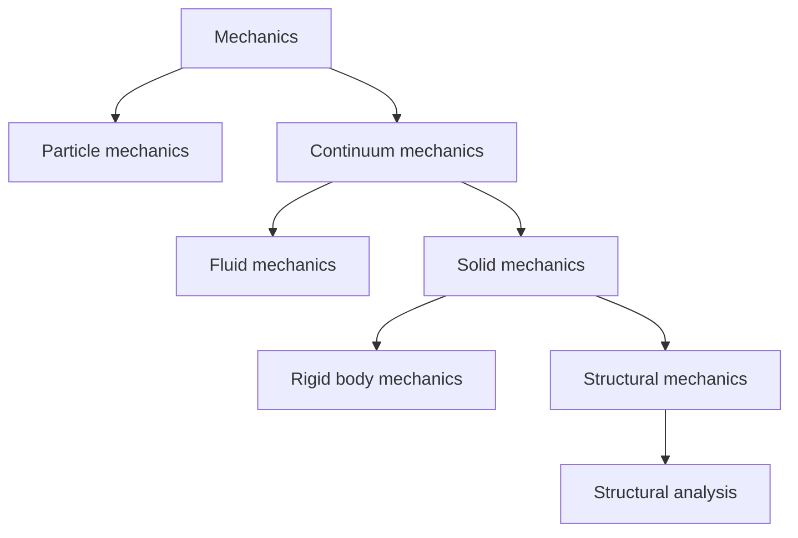

## Continuum Hypothesis
The chapter uses the idea of a **continuous body**. This means that matter is treated as if it is continuously distributed.

For example, density can be defined at a point as:

```text
rho = lim(Delta v -> 0) Delta m / Delta v
```

Where:

- `rho`: density
- `Delta m`: mass inside a small volume
- `Delta v`: small volume around the point

This is an idealization. In reality, matter is made of atoms, but the continuum model is very useful for engineering structures.

## The Structural Model
Any structural model usually needs three groups of equations.

| Group | What it describes |
|---|---|
| **Equilibrium equations** | Balance of forces and moments. |
| **Strain-displacement relations** | How displacement creates deformation. |
| **Constitutive equations** | How the material relates stress and strain. |

The solution must also satisfy **boundary conditions**. These describe supports, restrictions, and applied conditions.

The main unknowns in structural analysis are:

- **displacements**;
- **strains**;
- **stresses**.

## Structural Elements
Structural parts can be classified by their geometry.

| Element | Geometric idea | Example |
|---|---|---|
| **Block** | The three main dimensions have similar size. | Foundation block |
| **Surface structure** | Two dimensions are much larger than the third. | Plate or shell |
| **Shell** | Curved surface structure. | Dome, tank wall |
| **Plate** | Flat surface structure. | Slab |
| **Bar** | One dimension is much larger than the other two. | Beam, column, tie |

### Visual Classification
The first visual question is: **Which dimensions are large and which are small?**

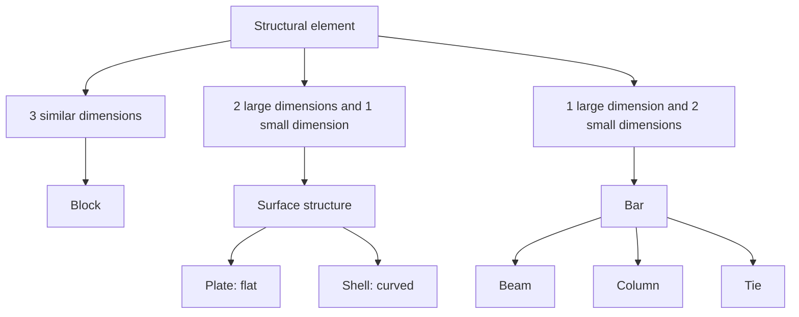

Visual rule:

- A **block** looks massive in all directions.
- A **plate** or **shell** looks thin.
- A **bar** looks long and slender.

Original page print:

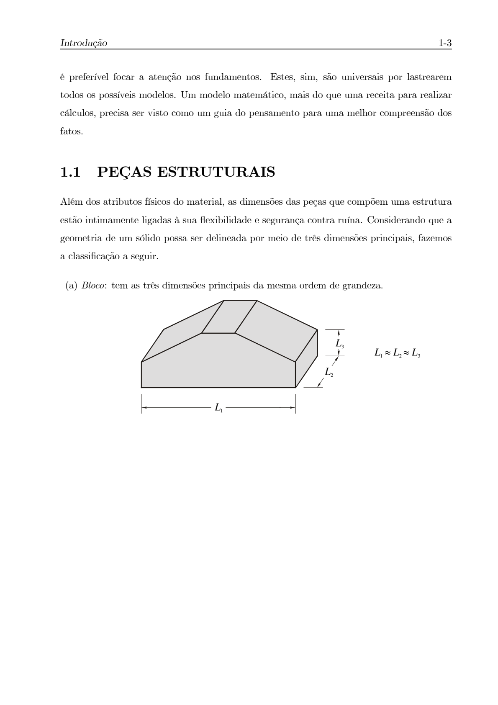

What this page helps you see:

- the chapter starts classifying elements by dimensions;
- the geometric idea is more important than the name;
- the sketches make the difference between a block and slender elements easier to remember.

### Bar Types

| Type | Main behavior |
|---|---|
| **Beam** | Mainly bending. |
| **Column** or **pillar** | Mainly compression. |
| **Tie** | Mainly tension. |

### Visual Behavior Of Bars

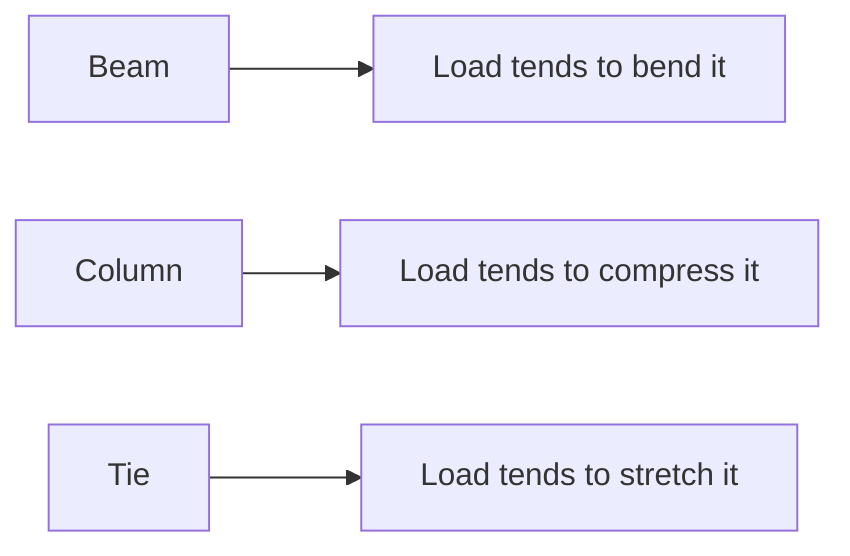

Do not classify a bar only by its shape. The same slender piece may behave differently depending on the load.

## Supports In Plane Structures
For a plane structure, a rigid body can move in three independent ways:

- translation in `x`;
- translation in `y`;
- rotation around `z`.

Supports remove some or all of these movements.

| Support type | Restricts | Allows | Reactions |
|---|---|---|---|
| **1st kind support** | Vertical displacement | Horizontal displacement and rotation | `Ry` |
| **2nd kind support** | Horizontal and vertical displacement | Rotation | `Rx`, `Ry` |
| **3rd kind support** or **fixed support** | Horizontal displacement, vertical displacement, and rotation | No rigid movement | `Rx`, `Ry`, `Mz` |

Original page prints:

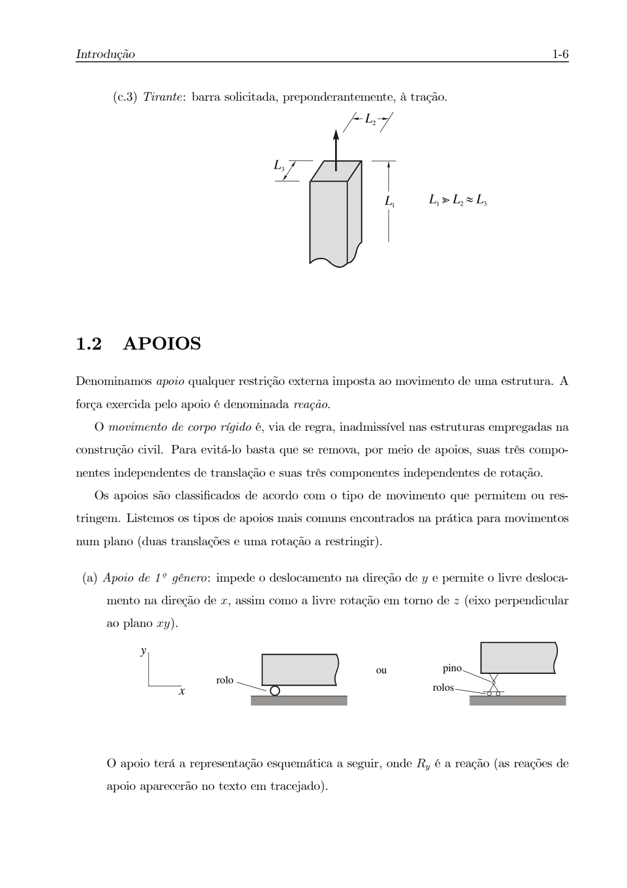

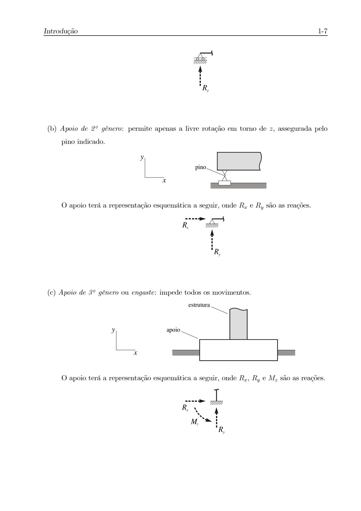

What these pages help you see:

- each blocked movement creates a reaction;
- a roller support has fewer reactions than a pin support;
- a fixed support also creates a moment reaction.

### Visual Support Checklist
When you see a support figure, identify:

1. Which translations are blocked?
2. Which rotations are blocked?
3. Which reactions appear because of those restrictions?

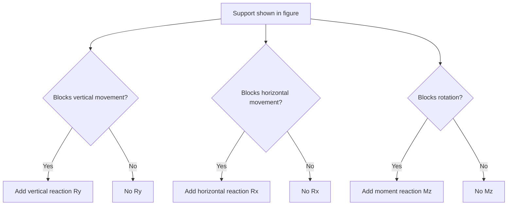

This is one of the most important visual skills in the chapter.

## Structural Design
The goal of structural design is to create a structure that satisfies:

- **safety**;
- **use** or **serviceability**;
- **economy**.

A good structure must be:

- strong enough not to fail;
- stiff enough not to deform excessively;
- economical enough to be practical.

## Design Process

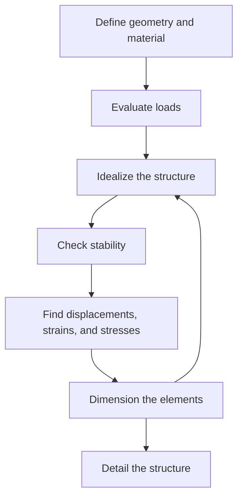

The arrow from **dimension the elements** back to **idealize the structure** is important. Design is often iterative. If an element does not satisfy a criterion, the engineer may need to change the dimensions and analyze again.

## Idealization Example
A real structure can be idealized in more than one way.

For example, a group of bars may be analyzed:

- as a complete grid, with bars working together;
- as separate bars, where one bar transfers a reaction to another.

Different idealizations can produce different models. The engineer must choose a model that is simple enough to use, but accurate enough for the problem.

Original page print:

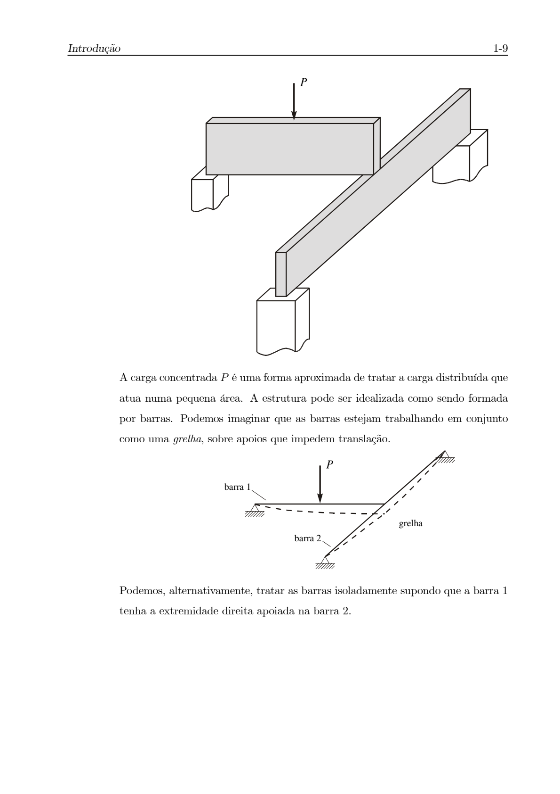

What this page helps you see:

- the same real structure can be simplified as a grid of bars;
- the concentrated load `P` is an approximation of a load over a small area;
- idealization is a modeling decision, not a fixed rule.

### Visual Lesson From Idealization
The same real structure can produce different drawings and different models.

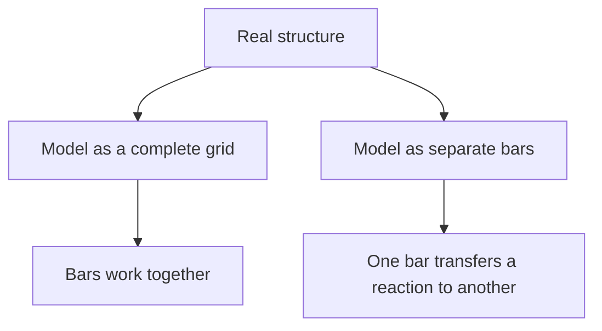

The figure teaches that modeling is a choice. A good model keeps the important behavior and removes unnecessary detail.

## Load Path
A useful question in structural analysis is:

> How does the load travel through the structure?

For a simplified building, the load path may be:

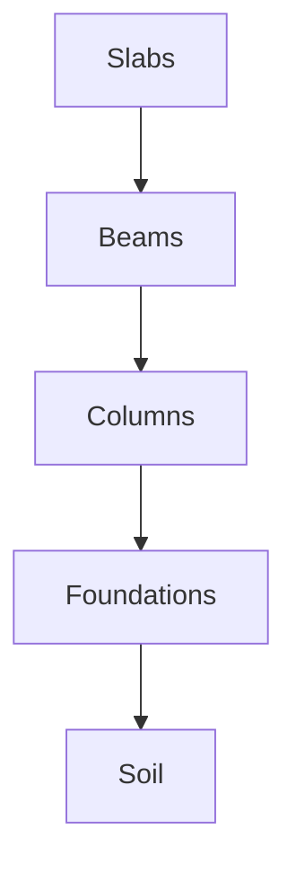

This helps identify which parts are more critical. In many buildings, lower columns and foundations are very important because they receive loads from many elements above them.

Original page print:

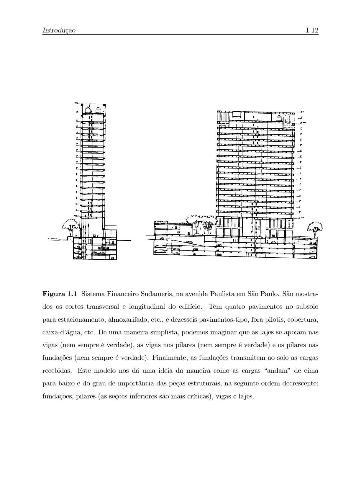

What this page helps you see:

- slabs, beams, columns, foundations, and soil form a load path;
- loads generally move from upper parts to lower parts;
- foundations and lower columns are critical because they collect many loads.

### Visual Load Path Habit
For every structural drawing, try to draw arrows for the load path.

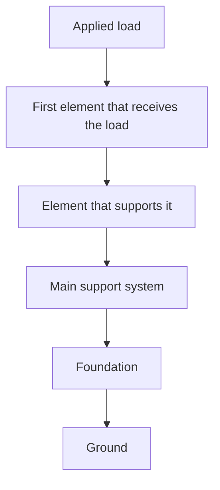

This habit helps you understand why some elements are more critical than others.

## Uncertainty And Safety
A structure is never absolutely `100%` safe.

Reasons:

- loads are uncertain;
- material resistance is uncertain;
- construction has imperfections;
- models are simplifications of reality.

Engineering design accepts that some risk exists. The goal is to keep this risk within acceptable limits, usually by following technical standards.

## Examples Mentioned In The Chapter
The chapter uses real structures to show different structural systems:

- buildings;
- Museu de Arte de São Paulo (MASP);
- water reservoirs;
- hangar roofs;
- bridges with different structural arrangements;
- suspended and cable-stayed bridges.

These examples help connect theory with real engineering decisions.

Original page prints:

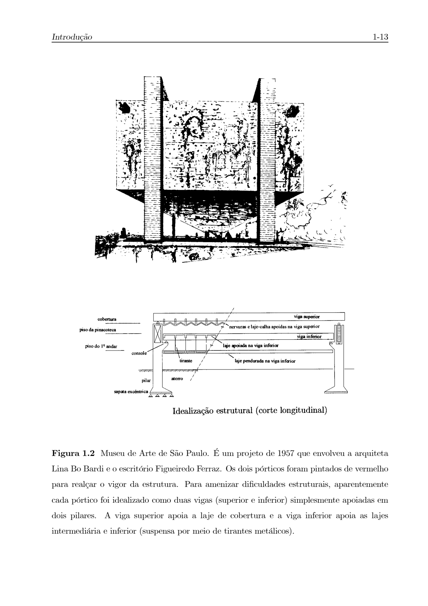

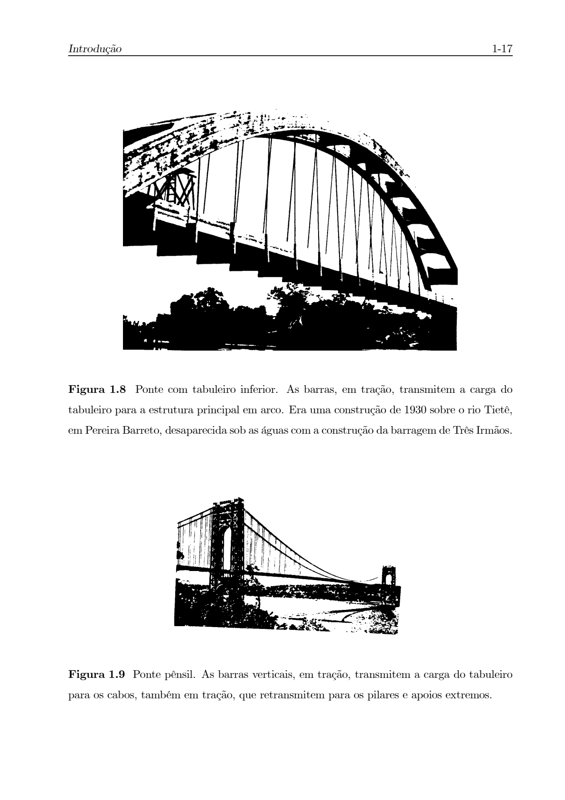

What these pages help you see:

- real structures can make the structural system visible;
- frames, arches, cables, and bars carry loads in different ways;
- visual examples help connect the abstract model to real engineering.

## What The Figures Teach

| Figure type | What to observe | Main lesson |
|---|---|---|
| Building structure | Slabs, beams, columns, foundations | Loads move from upper elements to lower elements. |
| MASP structure | Large red frames, suspended floors, long span | A structural concept can also define the architecture. |
| Water reservoir | Shell and central support | Curved thin structures can carry loads efficiently. |
| Hangar roof | Many bars in a roof system | Some bars may be structural, but some may also serve aesthetics or construction needs. |
| Multi-span bridge | Repeated supports and spans | Supports divide the structure and change internal forces. |
| Arch bridge | Compression path through the arch | Shape can guide forces mainly through compression. |
| Suspended bridge | Cables and vertical hangers | Tension elements can carry the deck load to towers and anchors. |
| Cable-stayed bridge | Inclined stays connected to towers | Tension stays transfer deck loads directly to pylons. |
| Frame support | Beams and columns connected rigidly | Frames resist loads through combined bending and axial forces. |

When reviewing the chapter, redraw simplified versions of these figures. The goal is not artistic quality. The goal is to understand the structural idea.

## Common Mistakes
- Thinking the model is exactly the same as the real structure.
- Forgetting that assumptions limit the validity of a model.
- Confusing beams, columns, and ties.
- Ignoring support reactions.
- Thinking design is only calculation.
- Checking strength but forgetting stiffness and excessive deformation.
- Forgetting that loads and material resistance have uncertainty.
- Looking at a figure only as an illustration, instead of reading it as a structural model.
- Copying a support symbol without understanding which movement it restricts.
- Drawing a load path that stops before reaching the foundation or ground.

## Quick Review
- Structural analysis studies structures under loads.
- A structure is represented by a model.
- A model depends on assumptions.
- The main equations are equilibrium, strain-displacement, and constitutive equations.
- Supports restrict movements and create reactions.
- Structural design must consider safety, use, and economy.
- Design is iterative.
- Load path explains how forces travel through a structure.
- Figures are part of the explanation. They show geometry, supports, reactions, load paths, and modeling choices.

## Questions To Review
1. What is the difference between a real structure and a structural model?
2. What are the three main groups of equations in a structural model?
3. What is a support reaction?
4. What movements exist in a plane rigid body?
5. What is the difference between a beam, a column, and a tie?
6. Why is structural design an iterative process?
7. Why is it impossible to guarantee that a structure is `100%` safe?
8. What is a load path, and why is it useful?
9. When looking at a support drawing, how do you decide which reactions exist?
10. Choose one figure from the chapter. What structural idea does it teach?
