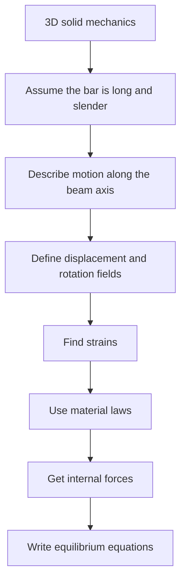
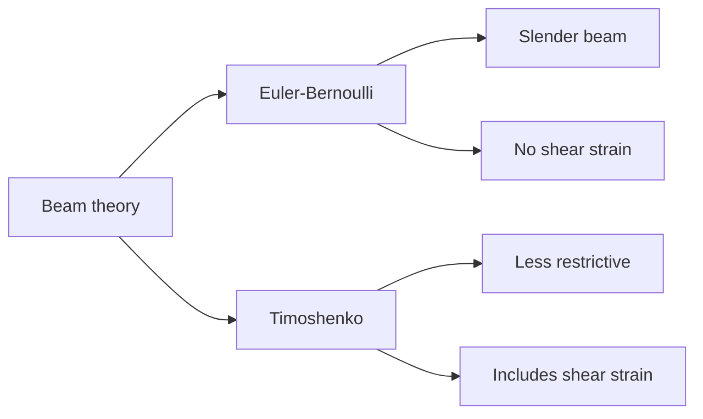
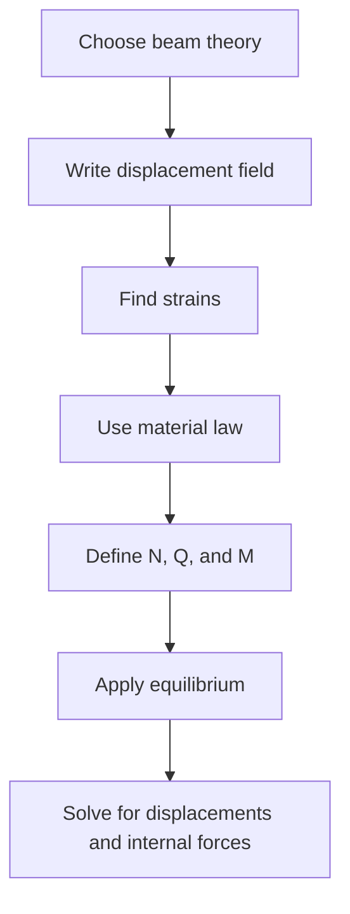

# Chapter 2: Beam Theory

## Source
- **File:** `materials/03-chapter-2-beam-theory.pdf`
- **Course:** Analise Estrutural I
- **Code:** EDI-31
- **Topic:** Beam theory

## Goal
Understand why beam theories are used, what assumptions they make, and how Euler-Bernoulli and Timoshenko beam models describe displacement, strain, internal forces, and equilibrium.

## Big Picture
Beam theory is a simplified way to study long structural members.

A real bar is a three-dimensional solid. Describing all stresses and displacements in 3D is possible, but it is often too complex for structural analysis. Beam theory reduces the problem to one main coordinate along the bar axis.

This simplification works well because a beam has:

- one dimension much larger than the other two;
- a cross-section that is small compared with the length;
- behavior that can be described mainly by axial deformation, bending, and shear.

In this chapter, the word **beam** is used in a broad sense. It may mean a beam, column, or tie, depending on the loading.

## Main Idea
Beam theory replaces a 3D solid problem with a 1D structural model.



The most important question is not only "Which formula do I use?" It is also:

**Which assumptions make this formula valid?**

## Coordinate Idea
A beam is usually described with:

| Symbol | Meaning |
|---|---|
| `x` | coordinate along the beam axis |
| `y`, `z` | coordinates inside the cross-section |
| `A` | cross-sectional area |
| `u_x`, `u_y`, `u_z` | displacement components |
| `epsilon_x` | normal strain in the beam direction |
| `gamma_xy`, `gamma_xz` | shear strains |

For a plane beam problem, the main motion is usually in the `x-y` plane.

## Two Beam Theories

| Theory | Main assumption | Shear deformation? | Best for |
|---|---|---|---|
| **Euler-Bernoulli beam theory** | Plane sections remain plane and perpendicular to the deformed axis. | Neglected | Slender beams |
| **Timoshenko beam theory** | Plane sections remain plane, but not necessarily perpendicular to the deformed axis. | Included | Deep beams or beams where shear matters |

### Visual Meaning
Euler-Bernoulli:

- the cross-section rotates with the slope of the deflected beam axis;
- shear distortion is ignored;
- bending is the dominant effect.

Timoshenko:

- the cross-section has its own rotation;
- the cross-section does not need to stay perpendicular to the deformed axis;
- shear deformation is part of the model.



## Kinematics
**Kinematics** describes how the beam moves and deforms.

### Euler-Bernoulli Kinematics
In Euler-Bernoulli theory, the transverse displacement is usually represented by `v(x)`.

The rotation of the cross-section is linked to the slope of the deflection curve:

```text
theta = dv/dx
```

A common displacement model is:

```text
u_x(x, y) = u(x) - y dv/dx
u_y(x, y) = v(x)
```

The axial strain becomes:

```text
epsilon_x = du/dx - y d2v/dx2
```

Where:

- `u(x)`: axial displacement of the beam axis;
- `v(x)`: transverse displacement;
- `dv/dx`: slope of the deflected axis;
- `d2v/dx2`: curvature;
- `y`: distance from the reference axis.

This formula shows two effects:

| Term | Meaning |
|---|---|
| `du/dx` | uniform axial stretching or shortening |
| `-y d2v/dx2` | bending strain, which changes across the section |

### Timoshenko Kinematics
In Timoshenko theory, the cross-section rotation is an independent variable.

```text
u_x(x, y) = u(x) - y theta(x)
u_y(x, y) = v(x)
```

The axial strain is:

```text
epsilon_x = du/dx - y dtheta/dx
```

The shear strain is:

```text
gamma_xy = dv/dx - theta
```

The key difference is that `theta` does not have to be equal to `dv/dx`.

## Internal Resultants
Instead of keeping every stress at every point of the cross-section, beam theory uses **resultants**.

| Resultant | Symbol | Meaning |
|---|---|---|
| Axial force | `N` | resultant of normal stress over the area |
| Shear force | `Q` | resultant of shear stress over the area |
| Bending moment | `M` | moment of normal stress about the section axis |

Typical definitions are:

```text
N = integral_A sigma_x dA
Q = integral_A tau_xy dA
M = integral_A sigma_x y dA
```

Where:

- `sigma_x`: normal stress in the beam direction;
- `tau_xy`: shear stress;
- `dA`: small area element of the cross-section.

## Constitutive Relations
**Constitutive relations** connect stress and strain through material behavior.

For a linear elastic material:

```text
sigma_x = E epsilon_x
```

Where:

- `E`: Young's modulus, usually in Pa, MPa, or GPa;
- `epsilon_x`: axial strain, dimensionless.

For Euler-Bernoulli bending, the bending moment is linked to curvature:

```text
M = - E I d2v/dx2
```

Where:

- `I`: second moment of area of the cross-section, in `m^4`;
- `E I`: bending stiffness.

For axial deformation:

```text
N = E A du/dx
```

For Timoshenko shear:

```text
Q = k G A gamma_xy
```

Where:

- `G`: shear modulus;
- `k`: shear correction factor;
- `G A`: shear stiffness before correction;
- `k G A`: effective shear stiffness.

## Equilibrium Equations
Beam equilibrium is obtained by balancing forces and moments along the beam.

In a plane beam, the common differential equilibrium equations are:

```text
dN/dx + q_x = 0
dQ/dx + q_y = 0
dM/dx - Q + m = 0
```

Where:

- `q_x`: distributed load in the axial direction, in `N/m`;
- `q_y`: distributed load in the transverse direction, in `N/m`;
- `m`: distributed moment, in `N`;
- `N`, `Q`, `M`: internal axial force, shear force, and bending moment.

The chapter derives equations of this type by integrating the 3D equilibrium equations over the cross-section.

## Why This Matters
Beam theory is powerful because it keeps the important behavior while removing unnecessary 3D detail.

| Real 3D problem | Beam model |
|---|---|
| Stress at every point | Internal resultants `N`, `Q`, `M` |
| Full displacement field | Functions like `u(x)`, `v(x)`, `theta(x)` |
| 3D equilibrium | 1D differential equilibrium |
| Complex solid geometry | Axis plus cross-section properties |

The price of this simplification is that the assumptions must be respected.

## Euler-Bernoulli vs Timoshenko

| Question | Euler-Bernoulli | Timoshenko |
|---|---|---|
| Does the section remain plane? | Yes | Yes |
| Does the section remain perpendicular to the deformed axis? | Yes | No |
| Is shear deformation included? | No | Yes |
| Main unknowns | `u(x)`, `v(x)` | `u(x)`, `v(x)`, `theta(x)` |
| Main bending measure | `d2v/dx2` | `dtheta/dx` |
| Main shear measure | approximately zero | `dv/dx - theta` |

## Visual Study Checklist
When studying a beam theory figure, ask:

1. What is the original beam axis?
2. What is the deflected shape?
3. Does the cross-section stay perpendicular to the axis?
4. Is the section rotation equal to the slope?
5. Which internal resultants appear: `N`, `Q`, `M`?
6. Which distributed loads act: `q_x`, `q_y`, or `m`?

## Common Mistakes
- Treating Euler-Bernoulli and Timoshenko as the same theory.
- Forgetting that Euler-Bernoulli neglects shear deformation.
- Confusing slope `dv/dx` with independent rotation `theta`.
- Using beam formulas without checking if the member is slender.
- Thinking `N`, `Q`, and `M` are point stresses. They are resultants over the cross-section.
- Forgetting units: `q` is force per length, while `Q` is force.

## Summary
Chapter 2 introduces beam theories as simplified models for long structural members.

Euler-Bernoulli theory is simpler and works well for slender beams because it neglects shear deformation. Timoshenko theory is less restrictive because it allows shear deformation and gives the cross-section its own rotation.

The main workflow is:



## Questions To Review
- Why can a beam be modeled with one main coordinate?
- What assumption makes Euler-Bernoulli simpler than Timoshenko?
- What is the physical meaning of curvature?
- What is the difference between stress and internal resultant?
- When should shear deformation not be ignored?
- How do `N`, `Q`, and `M` appear from stresses over the cross-section?
