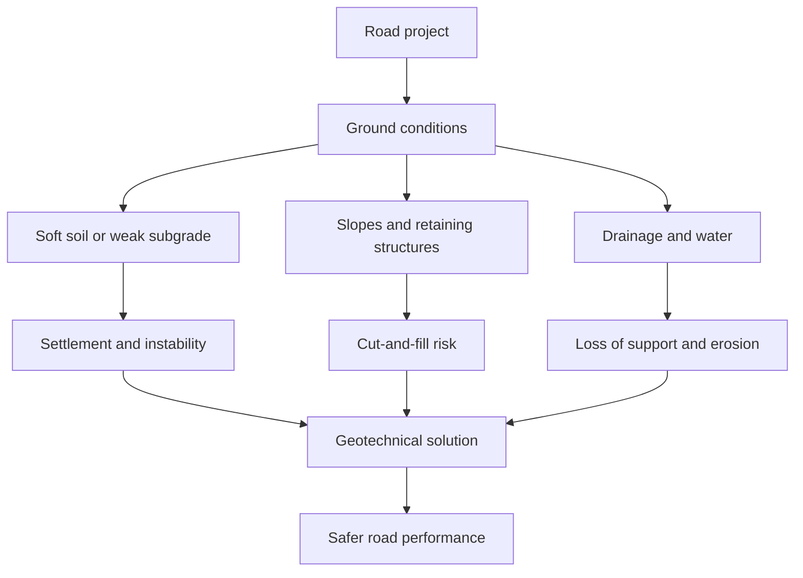

# Road Geotechnics Case Study Guide

This guide summarizes real road-related cases found in the internal `estudo_de_casos` documents. It is meant to help choose examples for a project about roads in a geotechnical context.

## What Are These Documents?

The `estudo_de_casos` folder contains **HUESKER Report - Casos de Obras** PDF volumes. These are technical case-study reports about real civil engineering works where geosynthetics were used.

They are useful for a road geotechnics project because many cases describe real problems in roads, highways, access roads, pavements, embankments, retaining walls, soft soils, drainage, and construction over weak ground.

When the table says **report page**, it means the page number shown in the document index or on the page itself, not necessarily the PDF viewer page number.

## Main Idea

Road projects are strongly affected by the ground below and beside the road. The most useful cases in the documents show problems such as:

- soft soils under embankments;
- low bearing capacity;
- settlement and differential settlement;
- slope and retaining-wall stability;
- pavement cracking and weak subgrade;
- drainage and construction constraints;
- environmental restrictions near mangroves, rivers, coastal areas, and protected areas.

## Best Cases For The Project

| Priority | Case | Where to find it | Report page | Location | Main geotechnical issue | Why it is useful |
|---|---|---|---|---|---|---|
| Very strong | Interligacao Via Dutra - Rod. Carvalho Pinto | `estudo_de_casos/1591297647E-book_HR__-_VOLUME_1.pdf` | Page 09 | Sao Jose dos Campos/SP | Road embankment over saturated organic soft soil | Shows reinforced embankments, geogrids, vertical drains, and settlement control. |
| Very strong | Interligacao Via Dutra - Rod. Carvalho Pinto, 2nd stage / Av. Mario Covas | `estudo_de_casos/1598288503E-book_HR__-_VOLUME_2.pdf` | Around page 41 | Sao Jose dos Campos/SP | Soft organic clay near a lagoon and road embankments | Very complete case: retaining walls, piled embankment, basal reinforcement, vertical drains, and granular columns. |
| Very strong | Via Expressa Sul | `estudo_de_casos/1591297647E-book_HR__-_VOLUME_1.pdf` | Page 28 | Florianopolis/SC | Road over mangrove and very soft clay | Shows low undrained shear strength, very thick soft soil, geotextile reinforcement, berms, vertical drains, and monitoring. |
| Very strong | Av. Beira-Mar Continental | `estudo_de_casos/1598288503E-book_HR__-_VOLUME_2.pdf` | Page 05 | Florianopolis/SC | Coastal expressway over marine soft clay | Shows hydraulic fill, geogrids, granular columns, vertical drains, consolidation, and environmental limits. |
| Very strong | Avenida TransOlimpica | `estudo_de_casos/1617058210E-book_HR__-_VOLUME_IV.pdf` | Page 05 | Rio de Janeiro/RJ | Urban mobility road over soft soils up to about 15 m thick | Good example of road infrastructure built with soil improvement, vertical drains, basal geogrids, and approach embankments. |
| Very strong | Contorno de Florianopolis | `estudo_de_casos/1617058210E-book_HR__-_VOLUME_IV.pdf` | Around page 48 | Florianopolis/SC | Highway embankment over wet, low-bearing coastal soils | Useful for explaining working platforms, drainage layers, geotextile reinforcement, and construction traffic. |
| Strong | Readequacao do Trevo de Jacarei, Via Dutra km 157 | `estudo_de_casos/1598288503E-book_HR__-_VOLUME_2.pdf` | Page 106 | Jacarei/SP | Road interchange embankment over 6-8 m of soft soil | Shows piled embankment with geogrid load transfer under geometric and environmental constraints. |
| Strong | Eixo viario do novo acesso ao centro de Rio das Ostras | `estudo_de_casos/1598288503E-book_HR__-_VOLUME_2.pdf` | Page 58 | Rio das Ostras/RJ | Access road over saturated organic clay with very low SPT resistance | Good for explaining geotextile working platforms, sand drainage blankets, vertical drains, and staged embankment construction. |
| Strong | BR-101/RS retaining walls | `estudo_de_casos/1598288503E-book_HR__-_VOLUME_2.pdf` and `estudo_de_casos/1617058210E-book_HR__-_VOLUME_IV.pdf` | Volume 2: around page 36; Volume IV: page 26 | Rio Grande do Sul | Road duplication with viaduct and underpass retaining structures | Shows reinforced soil walls, compaction, drainage, foundation improvement, and traffic restrictions. |
| Strong | Praca de Pedagio na Rodovia dos Tamoios | `estudo_de_casos/1617058210E-book_HR__-_VOLUME_IV.pdf` | Page 48 | Paraibuna/SP | Large cut-and-fill in mountainous terrain and protected area | Shows a 25 m reinforced soil wall, colluvium with low bearing capacity, drainage, and local soil reuse. |
| Strong | Rodoanel Mario Covas | `estudo_de_casos/1591297647E-book_HR__-_VOLUME_1.pdf` | Page 33 | Sao Paulo/SP | Pavement base over wet silty and micaceous subgrade | Useful for pavement geotechnics: subgrade moisture, excessive deflection, and base reinforcement. |
| Strong | Anel Viario de Campinas | `estudo_de_casos/1591297647E-book_HR__-_VOLUME_1.pdf` | Page 19 | Campinas/SP | Reflective cracking from cement-treated base | Useful for pavement pathology and asphalt reinforcement. |
| Strong | Via 09 - Canal do Arroio Fundo | `estudo_de_casos/1598288503E-book_HR__-_VOLUME_2.pdf` | Page 116 | Rio de Janeiro/RJ | Access road beside canal over thick soft soil and old fill | Combines low CBR subgrade, slope reinforcement, pavement base reinforcement, and urban constraints. |
| Useful | BR-282 pavement restoration | `estudo_de_casos/1617058210E-book_HR__-_VOLUME_IV.pdf` | Around page 52 | Santo Amaro da Imperatriz/SC | Degraded urban highway pavement with reflective cracking | Shows pavement restoration where thick asphalt overlay would affect drainage and sidewalk levels. |
| Useful | BR-227 / possible BR-277 third-lane restoration | `estudo_de_casos/1617058210E-book_HR__-_VOLUME_IV.pdf` | Around page 66 | Palmeira/PR | Cracking and high deflection in a third lane | Useful for discussing crack propagation, deflection, and geogrid reinforcement in asphalt restoration. |
| Optional | Contorno de Florianopolis and Rio Forquilha crossing | `estudo_de_casos/1617058210E-book_HR__-_VOLUME_IV.pdf` | Around page 43 | Sao Jose/SC | Channel slope protection near a highway crossing | Not mainly a road pavement case, but useful for drainage and hydraulic protection near road infrastructure. |

## Recommended Project Structure

Use five main cases if the project needs depth:

1. **Via Expressa Sul**: soft soil, mangrove, settlement, and environmental restrictions.
2. **Interligacao Via Dutra - Carvalho Pinto**: road embankment on saturated organic soil.
3. **Contorno de Florianopolis**: construction platform and drainage over weak coastal soil.
4. **Trevo de Jacarei**: piled embankment and geogrid load transfer.
5. **Rodoanel Mario Covas**: pavement base reinforcement and weak wet subgrade.

This set gives a good balance between earthworks, foundation behavior, drainage, pavement, and construction constraints.

## Concepts To Explain

| Concept | Simple definition | Connection to roads |
|---|---|---|
| Soft soil | Soil with low strength and high compressibility, often saturated clay or organic soil. | Can cause embankment instability and settlement. |
| Settlement | Downward movement of the ground under load. | Can deform pavement and create uneven road levels. |
| Differential settlement | Unequal settlement along a structure. | Can cause cracks, bumps, and unsafe road surfaces. |
| SPT | Standard Penetration Test, a field test used to estimate soil resistance. | Low SPT values often indicate weak soil needing treatment. |
| CBR | California Bearing Ratio, a test for subgrade support capacity. | Low CBR means the pavement base may need reinforcement or thicker layers. |
| Geogrid | A polymer grid used to reinforce soil or asphalt layers. | Improves stability, distributes loads, and reduces cracking. |
| Geotextile | A synthetic fabric used for separation, filtration, drainage, or reinforcement. | Helps create working platforms and prevents mixing of soil and granular layers. |
| Vertical drains | Drainage elements installed in soft clay to accelerate consolidation. | Reduce waiting time for settlement before final pavement. |
| Piled embankment | Embankment load transferred to piles, often with caps and geogrids. | Useful when soft soil is too weak for a conventional embankment. |
| Reinforced soil wall | Retaining wall made with compacted soil and reinforcement layers. | Allows steep embankment sides in limited spaces. |

## Case Selection By Theme

| Theme | Best cases |
|---|---|
| Soft soil under roads | Via Expressa Sul; Via Dutra - Carvalho Pinto; Rio das Ostras access road; TransOlimpica; Contorno de Florianopolis |
| Road embankments | Via Dutra - Carvalho Pinto; Trevo de Jacarei; Contorno de Florianopolis |
| Pavement and subgrade | Rodoanel Mario Covas; Anel Viario de Campinas; BR-282; BR-227/BR-277; Via 09 |
| Retaining structures | BR-101/RS; Rodovia dos Tamoios toll plaza; Via Dutra - Carvalho Pinto 2nd stage |
| Environmental constraints | Via Expressa Sul; Av. Beira-Mar Continental; Rodovia dos Tamoios; Contorno de Florianopolis |
| Construction logistics | Contorno de Florianopolis; Rio das Ostras access road; TransOlimpica; Trevo de Jacarei |

## Common Mistakes

- Treating roads only as pavement. In geotechnics, the ground, embankment, drainage, slopes, and foundations are also part of the road problem.
- Ignoring water. Saturated soil, poor drainage, and groundwater often control the behavior of road works.
- Assuming that soft soil only affects construction. It can also affect long-term performance through settlement.
- Confusing pavement reinforcement with soil reinforcement. Pavement reinforcement helps reduce cracking and improve layer behavior, while soil reinforcement helps stabilize earth structures and weak foundations.
- Forgetting construction access. Many cases used geotextiles first to allow machines to work safely over weak ground.

## Short Conclusion

The strongest message from the case studies is that road performance depends on both pavement design and geotechnical design. Roads over weak, wet, or compressible soils need special solutions such as geosynthetics, vertical drains, staged embankments, soil improvement, retaining structures, and careful drainage.

## Sources

- `estudo_de_casos/1591297647E-book_HR__-_VOLUME_1.pdf`
- `estudo_de_casos/1598288503E-book_HR__-_VOLUME_2.pdf`
- `estudo_de_casos/1617058210E-book_HR__-_VOLUME_IV.pdf`
